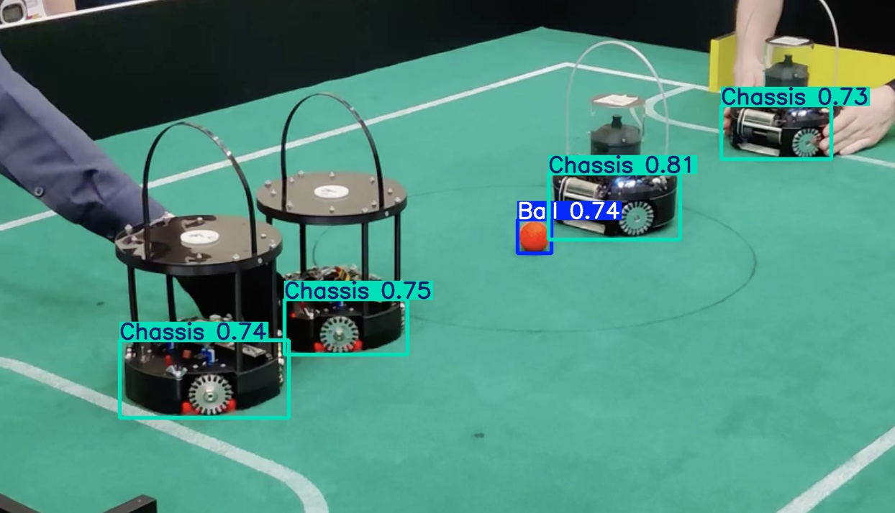

# ArisuIntelligence

<!-- 在这里可以添加一些徽章，例如构建状态、许可证等 -->
[](./LICENSE)

> 爱丽丝才不是魔王，是勇者！

<div align="center">
  
  <br>
  <em>图源: <a href="https://www.pixiv.net/artworks/108461210">Pixiv @殘夜 ZANYA</a></em>
</div>

## ✨ 介绍

本项目是一个为RCJ足球重量组（Open）场景，基于3万+张图片的数据集训练的YOLOv8s模型。可以高鲁棒性，定位场地中的高尔夫球或是敌方/我方机器底盘。

<div align="center">
  
  <br>
</div>

## 📊 可识别类别

- **高尔夫球**: ✅支持良好
- **蓝/黄色球门**: ❌基本不可用
- **机器底盘**: ✅支持良好

## 🚀 快速上手

> 我们发布了标准YOLO权重文件(.pt)和Hailo推理文件(.hef)可供使用。

### Python+YOLO推理

1. 克隆仓库

2. 安装Ultralytics相关依赖库
```bash
pip install -y ultralytics
```

3. 执行下列程序开始推理

```python
from ultralytics import YOLO

# 加载模型
model = YOLO("model.pt")

# 对单张图片推理
results = model("test12.png",conf=0.5, imgsz=640)

# 处理结果
for result in results:
    # 获取检测框
    boxes = result.boxes
    if boxes is not None:
        # 打印置信度和类别
        for box in boxes:
            print(f"类别: {box.cls}, 置信度: {box.conf}")
    
    # 保存结果图片
    result.save('output.jpg')
```

### 树莓派上使用Python+Hailo推理

1. 克隆仓库

2. 安装树莓派Hailo依赖包
```bash
apt install -y hailo-all
```

3. 执行下列程序开始推理
```python
import numpy as np
from hailo_platform import VDevice, HailoSchedulingAlgorithm

timeout_ms = 1000

params = VDevice.create_params()
params.scheduling_algorithm = HailoSchedulingAlgorithm.ROUND_ROBIN

# The vdevice is used as a context manager ("with" statement) to ensure it's released on time.
with VDevice(params) as vdevice:

    # Create an infer model from an HEF:
    infer_model = vdevice.create_infer_model('model.hef')

    # Configure the infer model and create bindings for it
    with infer_model.configure() as configured_infer_model:
        bindings = configured_infer_model.create_bindings()

        # Set input and output buffers
        # 此处替换为输入图像
        buffer = np.empty(infer_model.input().shape).astype(np.uint8)
        bindings.input().set_buffer(buffer)

        buffer = np.empty(infer_model.output().shape).astype(np.float32)
        bindings.output().set_buffer(buffer)

        # Run synchronous inference and access the output buffers
        configured_infer_model.run([bindings], timeout_ms)
        buffer = bindings.output().get_buffer()

        print(buffer)
```


